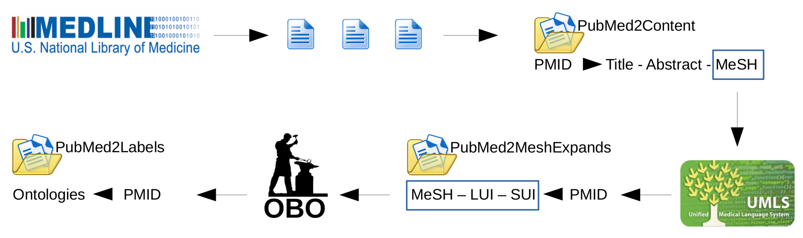

# MEDOBO
Automatically tagging MEDLINE abstracts with OBO ontologies


### Step 1: Processing UMLS
Download the [UMLS bulk](https://www.nlm.nih.gov/research/umls/licensedcontent/umlsknowledgesources.html) after acquiring the licence (e.g., umls-2022AA-full.zip) and place it in the 'umls' folder.

Run the following commands in the console one by one.
```bash
unzip umls-2022AA-full.zip

mkdir META
mkdir NET
unzip 2022AA-full/2022aa-1-meta.nlm
unzip 2022AA-full/2022aa-2-meta.nlm
unzip 2022AA-full/2022aa-otherks.nlm

gunzip 2022AA/META/MRCONSO.RRF.aa.gz
gunzip 2022AA/META/MRCONSO.RRF.ab.gz
gunzip 2022AA/META/MRCONSO.RRF.ac.gz
cat 2022AA/META/MRCONSO.RRF.aa 2022AA/META/MRCONSO.RRF.ab 2022AA/META/MRCONSO.RRF.ac > META/MRCONSO.RRF

gunzip 2022AA/META/MRDEF.RRF.gz
mv 2022AA/META/MRDEF.RRF META/

gunzip 2022AA/META/MRSTY.RRF.gz
mv 2022AA/META/MRSTY.RRF META/

mv 2022AA/NET/SRDEF NET/
mv 2022AA/NET/SRSTRE1 NET/

gunzip 2022AA/META/MRXNS_ENG.RRF.aa.gz
gunzip 2022AA/META/MRXNS_ENG.RRF.ab.gz
cat 2022AA/META/MRXNS_ENG.RRF.aa 2022AA/META/MRXNS_ENG.RRF.ab > META/MRXNS_ENG.RRF

gunzip 2022AA/META/MRXNW_ENG.RRF.aa.gz
gunzip 2022AA/META/MRXNW_ENG.RRF.ab.gz
gunzip 2022AA/META/MRXNW_ENG.RRF.ac.gz
cat 2022AA/META/MRXNW_ENG.RRF.aa 2022AA/META/MRXNW_ENG.RRF.ab 2022AA/META/MRXNW_ENG.RRF.ac > META/MRXNW_ENG.RRF
```

### Step 2: Create an environment
```bash
$ conda create -n medobo python=3.6
$ conda activate medobo
(medobo)$ pip install -r requirements.txt
```

### Step 3: Get OBO ontologies
Download [OBO ontologies](https://drive.switch.ch/index.php/s/HSL9gkPfjAE77s1) as a folder and place in the root of project


### Step 4: Processing MEDLINE
```bash
(medobo)$ python dataset.py 
```
Or download the preprocessed data from the [Switch drived](https://drive.switch.ch/index.php/s/HSL9gkPfjAE77s1) (for replication purposes, please make sure not to generate a new dataset, instead download the official splits and contents from [Switch drive](https://drive.switch.ch/index.php/s/HSL9gkPfjAE77s1))
 

### Step 5: Pre-processing OBO
```bash
(medobo)$ python chi_sqaure.py 
```

### Step 6: Download embeddings
Download [BioASK embedding](http://bioasq.org/news/bioasq-releases-continuous-space-word-vectors-obtained-applying-word2vec-pubmed-abstracts), unzip and place it in 'Resources' folder


### Naive Bayes baseline
```bash
(medobo)$ python main_NB.py <num_of_training_data>
(medobo)$ python main_NB.py 100000
```


### Deep learning baseline
```bash
(medobo)$ python main_DL.py <num_of_training_data> <num_of_features>
(medobo)$ python main_DL.py 100000 50000
```